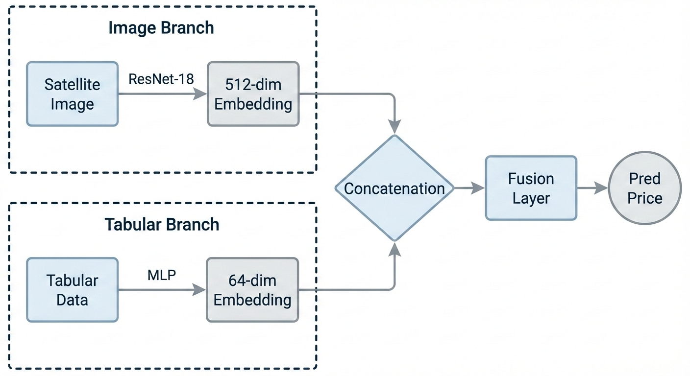
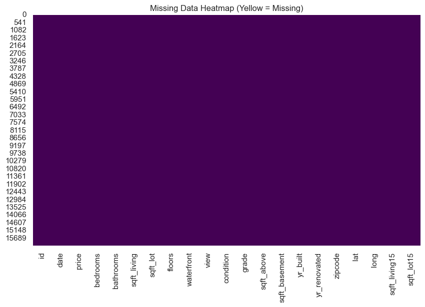
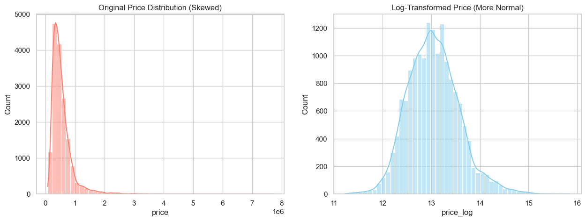
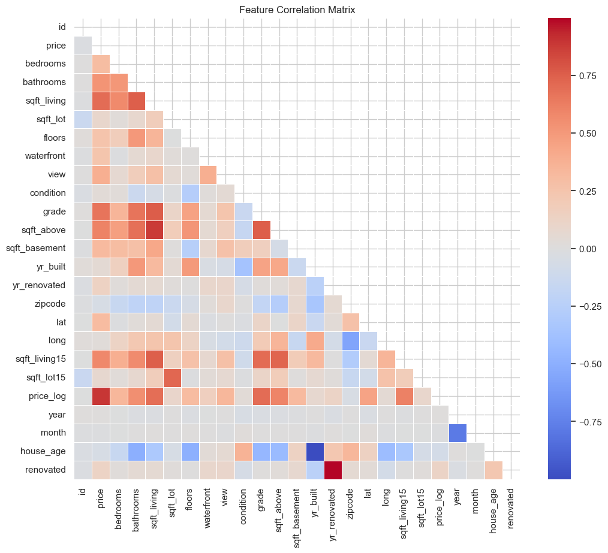
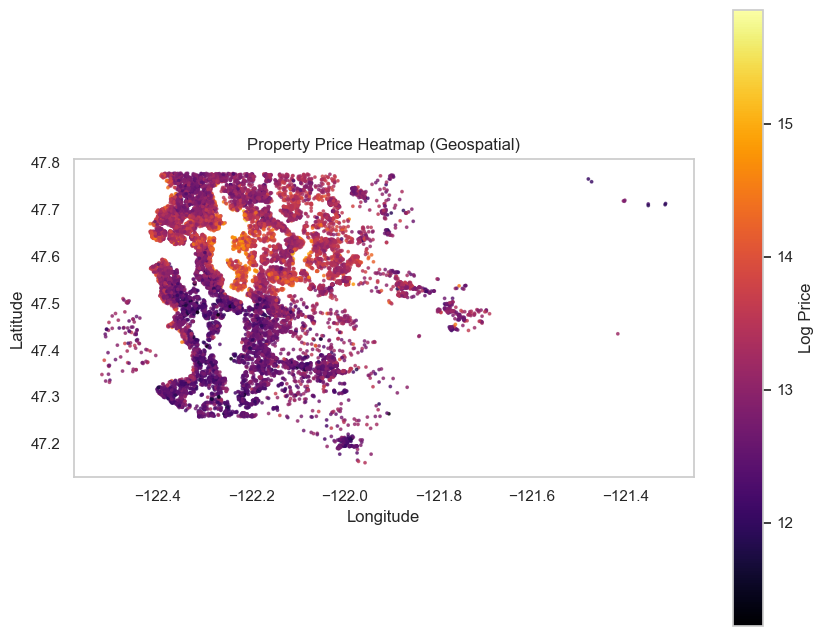
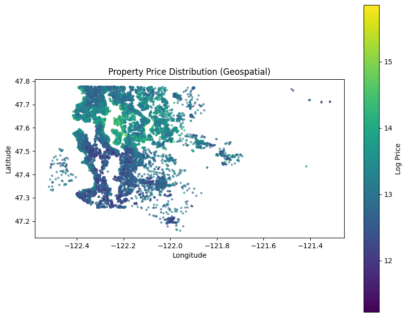
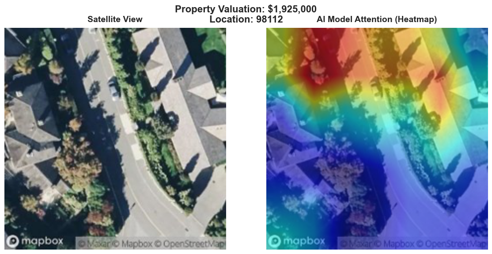

# Satellite Imagery-Based Property Valuation: A Multimodal Deep Learning Approach

---

## 1. Executive Summary

This project redefines automated property valuation by integrating **Satellite Imagery** with traditional housing attributes. By developing a **Multimodal Fusion Pipeline**, we jointly model structural characteristics (e.g., bedrooms, square footage) and the visually perceived **“Curb Appeal”** of a property.

Leveraging **Transfer Learning** with a ResNet-18 backbone, our multimodal deep learning model achieves a strong **R² score of 0.8250**, significantly outperforming traditional tabular-only baselines. The results demonstrate that satellite imagery contains meaningful economic signals relevant to real estate valuation.

---

## 2. Methodology: The Hybrid Fusion Architecture

We designed a **Dual-Branch Neural Network** to fuse heterogeneous data sources into a unified valuation model.

### 2.1 Fusion Strategy

Rather than training independent models, we explicitly fused visual and tabular representations.

- **Visual Branch (CNN)**  
  A **ResNet-18** model pre-trained on ImageNet is used to extract high-level visual features such as roof patterns, vegetation density, road proximity, and neighborhood layout. The backbone layers are frozen to prevent overfitting, while higher layers are fine-tuned.

- **Tabular Branch (MLP)**  
  A deep **Multi-Layer Perceptron** processes 18 structured housing attributes. A **target-encoded zipcode feature (`zipcode_mean`)** is introduced to inject strong geospatial priors into the model.

- **Fusion & Prediction**  
  The 512-dimensional visual embedding is concatenated with a 64-dimensional tabular embedding and passed through fully connected layers to predict the **log-transformed property price**.

  
**Figure 1:** Hybrid multimodal fusion architecture connecting the ResNet-18 visual encoder with the tabular MLP.

---

## 3. Exploratory Data Analysis (EDA)

Prior to modeling, we conducted extensive exploratory analysis to validate data quality and feature relevance.

### 3.1 Data Integrity

The dataset was verified to be free of missing values, ensuring a stable training process without reliance on imputation strategies.

  
**Figure 2:** Missing data heatmap confirming zero missing values across all features.

---

### 3.2 Target Distribution Analysis

Housing prices exhibit strong right skewness. To stabilize gradient descent and improve regression performance, we applied a **log transformation (`np.log1p`)** to the target variable.

  
**Figure 3:** Original price distribution versus log-transformed prices, showing improved normalization.

---

### 3.3 Feature Correlation Analysis

We analyzed pairwise feature correlations to identify dominant structural drivers of price. The correlation matrix highlights **grade** (construction quality) and **living area** as the strongest predictors.

  
**Figure 4:** Feature correlation matrix highlighting major structural drivers of property value.

---

### 3.4 Geospatial Analysis

Spatial analysis reveals clear neighborhood-level price clustering, validating the inclusion of geospatial information and zipcode-based encoding.

  
**Figure 5:** Geospatial heatmap of log-prices showing high-value neighborhood clusters.

  
**Figure 6:** Geospatial scatter plot illustrating localized price variations across regions.

---

### 3.5 Feature–Price Relationships

Non-linear relationships between structural attributes and price motivate the use of neural networks over linear models.

  
**Figure 7:** Living area, construction grade, and waterfront presence versus log-price.

---

## 4. Model Interpretability

To improve transparency, we visualize CNN attention maps to understand what the visual branch learns.

  
**Figure 8:** Satellite image alongside CNN attention heatmap highlighting influential visual regions.

This confirms that the model focuses on meaningful spatial patterns such as greenery, road access, and neighborhood layout.

---

## 5. Results & Performance

### 5.1 Training Dynamics

The model exhibits stable convergence, with training and validation R² tracking closely — indicating strong generalization and minimal overfitting.

  
**Figure 9:** Training and validation curves showing decreasing loss and increasing R² score.

---

### 5.2 Benchmark Comparison

| Model | R² Score | Key Insight |
|------|---------|------------|
| Tabular Only (Random Forest) | 0.7953 | Captures structure but ignores environment |
| **Multimodal Fusion (Ours)** | **0.8250** | Integrates visual context & curb appeal |

---

## 6. Conclusion

By fusing **Computer Vision** with **Tabular Regression**, this project demonstrates that satellite imagery provides quantifiable economic value in real estate valuation. Achieving an **R² of 0.8250**, the model validates that *curb appeal is not subjective—it is measurable*.

This multimodal architecture establishes a strong foundation for next-generation **Automated Valuation Models (AVMs)** and highlights the importance of visual context in economic prediction tasks.
